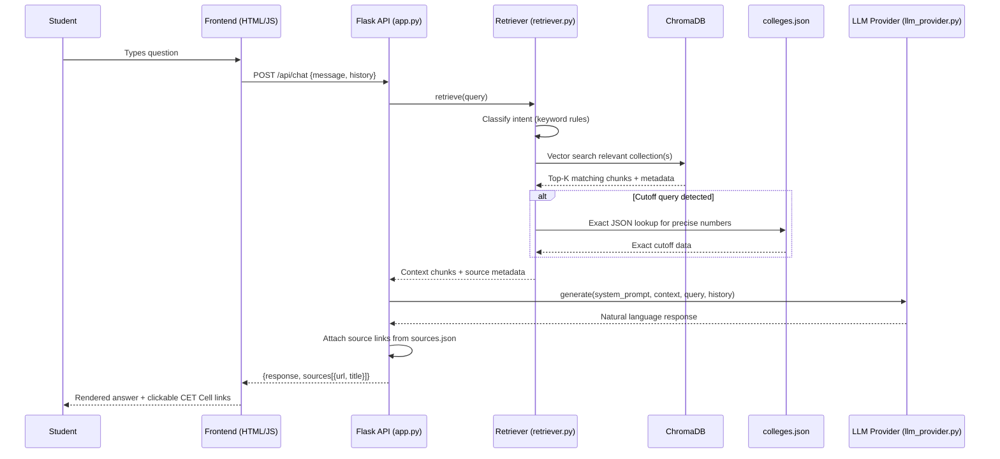
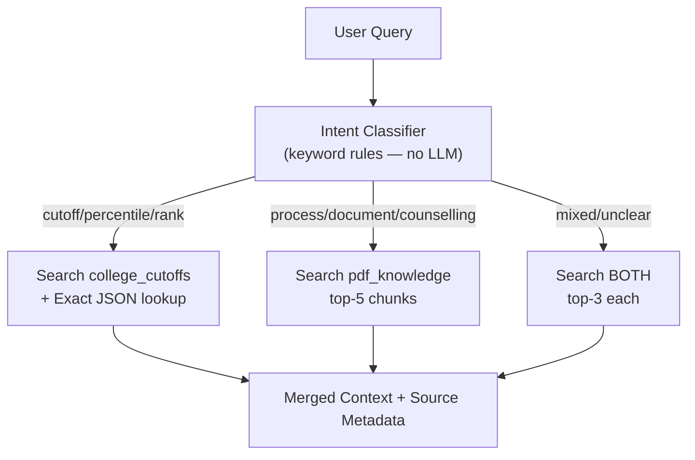
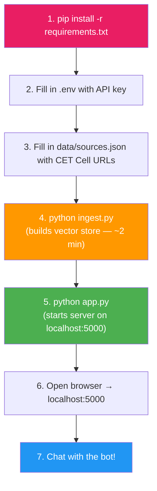

# MHT-CET RAG Chatbot — Final Implementation Plan

A RAG chatbot for rankmatch.in where **all knowledge comes from retrieved CET Cell documents** and the LLM only formats sentences. The LLM provider is fully abstracted — swap providers by editing one file.

---

## End-to-End Workflow



---

## Open Question

> [!IMPORTANT]
> **Source Links**: Please provide the CET Cell URLs for each PDF. I'll create a `data/sources.json` template for you to fill in. Without these, source citations will show filenames instead of clickable links.

---

## Proposed Changes

### 1. LLM Provider (Easily Swappable)

#### [NEW] [llm_provider.py](file:///d:/cet%20chatbot/llm_provider.py)

The **only file you edit to change your LLM**. Ships with a Gemini implementation and a simple interface that any provider can plug into.

```python
# ----- CHANGE THESE TO SWITCH PROVIDERS -----
LLM_PROVIDER = "gemini"            # "gemini" | "openai" | "groq" | "ollama"
LLM_MODEL = "gemini-2.5-flash-lite"
# --------------------------------------------
```

| Provider | Model Examples | What to change |
|----------|---------------|----------------|
| Gemini | `gemini-2.5-flash-lite`, `gemini-2.5-flash` | Set `LLM_PROVIDER = "gemini"`, add `GEMINI_API_KEY` to `.env` |
| OpenAI | `gpt-4o-mini`, `gpt-3.5-turbo` | Set `LLM_PROVIDER = "openai"`, add `OPENAI_API_KEY` to `.env` |
| Groq | `llama-3.1-8b-instant` | Set `LLM_PROVIDER = "groq"`, add `GROQ_API_KEY` to `.env` |
| Ollama | `llama3.1`, `mistral` | Set `LLM_PROVIDER = "ollama"`, no API key needed |

Exposes a single function:

```python
def generate(system_prompt: str, context: str, query: str, history: list[dict]) -> str:
    """Send context + query to the configured LLM. Returns plain text response."""
```

#### [NEW] [.env.example](file:///d:/cet%20chatbot/.env.example)

```env
# Uncomment the provider you're using:
# GEMINI_API_KEY=your_key_here
# OPENAI_API_KEY=your_key_here
# GROQ_API_KEY=your_key_here
```

---

### 2. RAG Ingestion Pipeline

#### [NEW] [ingest.py](file:///d:/cet%20chatbot/ingest.py)

One-time script. Run whenever source data changes.

**What it does:**
1. **Extract text** from all 10 PDFs using `pdfplumber`
2. **Chunk** into ~400-token segments with 50-token overlap (`RecursiveCharacterTextSplitter`)
3. **Convert college data** from `colleges.json` into natural-language text chunks:
   ```
   College: Government College of Engineering, Amravati
   Branch: Computer Science and Engineering | Code: 24210
   Region: Amravati | District: Amravati
   CAP Round 1 — GOPENS: 97.37, GSCS: 94.78, GSTS: 85.96, ...
   CAP Round 2 — GOPENS: 97.23, ...
   ```
4. **Build category code reference** — maps all 232 codes to readable names (GOPENS → "General Open State Level", etc.)
5. **Embed all chunks** using `sentence-transformers/all-MiniLM-L6-v2` (local, free)
6. **Store in ChromaDB** at `data/chroma_db/` in two collections:
   - `pdf_knowledge` — process, rules, normalization, counselling info
   - `college_cutoffs` — college-branch cutoff data

**Expected output:** ~800 PDF chunks + ~2,500 college chunks embedded and persisted.

---

### 3. Retrieval Engine

#### [NEW] [retriever.py](file:///d:/cet%20chatbot/retriever.py)

**Hybrid retrieval — vector search + exact JSON lookup:**



**Key design:**
- **Intent classification** uses keyword matching (zero cost, zero latency) — words like "cutoff", "percentile", "seat" → cutoff query; "process", "document", "counselling", "rule" → process query
- **Cutoff numbers** are always fetched from raw JSON after vector search identifies the college/branch — guarantees **exact numbers**
- **Fuzzy college name matching** via `difflib.get_close_matches()` — handles "COEP" → "Government College of Engineering, Pune"
- **Source metadata** travels with every chunk so citations are automatic

---

### 4. Response Generator

#### [NEW] [generator.py](file:///d:/cet%20chatbot/generator.py)

- Takes retrieved context + user query + conversation history
- Calls `llm_provider.generate()` — completely provider-agnostic
- Formats source citations from chunk metadata + `sources.json`
- Returns structured response: `{answer, sources[], suggested_questions[]}`

---

### 5. System Prompt

#### [MODIFY] [prompt.txt](file:///d:/cet%20chatbot/prompt.txt)

Comprehensive system prompt:
- Persona: Knowledgeable, friendly MHT-CET counsellor
- **Strict grounding**: "Answer ONLY from the provided context. If the answer isn't in the context, say so."
- Source citation format instructions
- Category code decoding rules
- Table formatting for cutoff comparisons
- Scope guard: decline non-MHT-CET questions politely

---

### 6. Flask API Server

#### [NEW] [app.py](file:///d:/cet%20chatbot/app.py)

| Endpoint | Method | Request | Response |
|----------|--------|---------|----------|
| `/` | GET | — | Serves `static/index.html` |
| `/api/chat` | POST | `{message, history[]}` | `{response, sources[], suggestions[]}` |
| `/api/colleges` | GET | — | `{colleges: ["name1", ...]}` (for autocomplete) |

---

### 7. Source Mapping

#### [NEW] [data/sources.json](file:///d:/cet%20chatbot/data/sources.json)

Template for you to fill with CET Cell URLs:

```json
{
  "Information_Brochure_UG_PG_2025_26_Final_02_07_2025.pdf": {
    "url": "",
    "title": "Information Brochure UG/PG 2025-26"
  },
  "MHT-CET-2026-Result-Processing-Methodology.pdf": {
    "url": "",
    "title": "Result Processing Methodology 2026"
  }
}
```

---

### 8. Frontend Chat UI

#### [NEW] [static/index.html](file:///d:/cet%20chatbot/static/index.html)

- Chat interface with message bubbles (user right, bot left)
- Markdown rendering in responses (tables, bold, lists)
- Source citations as clickable chips → CET Cell website
- Suggested starter questions on load
- College name autocomplete in input
- Thinking indicator ("Searching CET Cell documents...")

#### [NEW] [static/style.css](file:///d:/cet%20chatbot/static/style.css)

- Dark glassmorphism theme with vibrant accent colors
- Inter/Outfit typography from Google Fonts
- Smooth slide-in animations for messages
- Mobile-responsive layout
- Styled source citation chips with hover effects

#### [NEW] [static/script.js](file:///d:/cet%20chatbot/static/script.js)

- Chat message send/receive
- Conversation history tracking (client-side)
- Markdown → HTML rendering
- Source chip rendering with link icons
- College autocomplete dropdown
- Enter to send, Shift+Enter for newline

---

### 9. Dependencies

#### [NEW] [requirements.txt](file:///d:/cet%20chatbot/requirements.txt)

```
flask
flask-cors
pdfplumber
python-dotenv
sentence-transformers
chromadb
langchain-text-splitters
google-generativeai
```

---

## Final File Structure

```
d:\cet chatbot\
│
├── app.py                 # Flask server — routes + entry point
├── llm_provider.py        # ⭐ LLM config — edit THIS to switch providers
├── ingest.py              # One-time: PDFs + JSON → ChromaDB
├── retriever.py           # Hybrid retrieval engine
├── generator.py           # Context → LLM → formatted response
├── prompt.txt             # System prompt for the LLM
├── requirements.txt       # Python dependencies
├── .env.example           # API key template
├── .env                   # Your actual keys (gitignored)
│
├── data/
│   ├── colleges.json      # 368 colleges, 103 branches, 4 CAP rounds
│   ├── sources.json       # PDF → CET Cell URL mapping (you fill in)
│   ├── chroma_db/         # Generated: vector store (after running ingest.py)
│   └── *.pdf              # 10 CET Cell source PDFs
│
└── static/
    ├── index.html         # Chat UI
    ├── style.css          # Premium styling
    └── script.js          # Frontend logic
```

---

## Execution Order



---

## Verification Plan

### Automated

```bash
# Build vector store (should report chunk counts)
python ingest.py

# Test retrieval in isolation
python -c "from retriever import retrieve; r = retrieve('COEP computer science cutoff'); print(r['context'][:200])"

# Test full pipeline
python -c "from generator import generate_response; print(generate_response('What documents are needed?', []))"

# Start server
python app.py
```

### Manual Test Queries

| Query | Expected Behavior |
|-------|-------------------|
| "What is the MHT-CET admission process?" | Retrieves brochure PDF chunks → explains → cites brochure link |
| "COEP CS cutoff for OPEN" | Vector search finds COEP → JSON lookup gets exact 97.37 → cites cutoff source |
| "Explain normalisation" | Retrieves methodology PDF → explains → cites methodology PDF |
| "Compare VIT vs PICT for CS" | Retrieves both → side-by-side table → cites cutoff source |
| "Best colleges in Pune for CS" | Filters by region → ranks by GOPENS cutoff → cites cutoff source |
| "Who won the IPL?" | Politely declines — out of scope |
